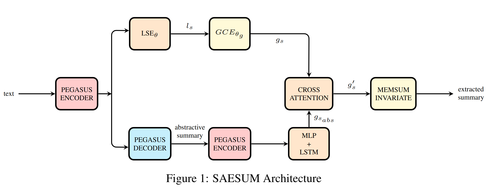

# 🚀 **Simultaneous Abstractive and Extractive Summarization**  

📖 Over the years, the **Natural Language Processing (NLP)** community has shown increasing interest in enhancing both **abstractive** and **extractive** text summarization techniques. However, relatively little attention has been given to methodologies that address both tasks **simultaneously**, despite their conceptual and semantic similarities.  

💡 This repository presents **SAESUM**, a framework designed to perform extractive and abstractive summarization **together**, leveraging the strengths of abstractive summarization to enhance the extractive component.  

  

---

## 🔍 **Overview**  

Summarization is an essential **Natural Language Processing (NLP)** task that focuses on generating **concise** and **informative** summaries from large bodies of text. 📜🔍
📝 Summarization methods are typically categorized into two main types:  

- ✨ **Abstractive Summarization** – Interprets and paraphrases the main concepts to create a coherent summary.  
- 📌 **Extractive Summarization** – Extracts the most relevant sentences while maintaining the original text structure.  

Each method has its strengths and limitations. Abstractive summarization involves **more computationally intensive NLP techniques** 🖥️ and is harder to evaluate due to the lack of one-to-one mappings with the source text. Meanwhile, extractive summarization focuses on **preserving exact information** and is more suitable when training data is limited.  

To achieve a more robust and effective summarization system, we have developed **SAESUM** 💡 – a hybrid model that integrates abstractive and extractive summarization. Our model **enhances extractive summaries by incorporating contextual information from abstractive summaries**. It combines the **MemSum [Gu et al., 2022](https://arxiv.org/abs/2203.08458) 📌 extractive summarization algorithm** and **PEGASUS [Zhang et al., 2020](https://arxiv.org/abs/1912.08777) 🐎 for abstractive summarization**.  

🔥 Recent advancements in **Transformers*** have revolutionized NLP tasks, including summarization. Pre-transformer era models relied on **word embeddings** (e.g., **Word2Vec, GloVe**), and sequence models like **LSTMs**, which struggled with long-text dependencies.  

🔥 Modern summarization systems now leverage **Transformer-based architectures**, this inspired us to enhance **MemSum** 📌, which uses **reinforcement learning** 🧠 to select key sentences, with **semantic information from abstractive summaries**, leading to the development of **SAESUM** 💡.  

Unlike previous works, which primarily use **extractive summaries to enhance abstractive summarization**, SAESUM does the **opposite** – improving extractive summarization using abstractive-generated information.

---

## 🛠️ **How to Use This Repository**  

### ✅ **Installation**  
First, install the required dependencies:  

```bash
pip install -r requirements.txt -q
```

### 🚀 **Running Experiments**  

#### 🔹 **SAESUM (Abstractive + Extractive)**
```bash
python src/src/MemSum_Full/train.py -wandb_logger True -two_heads True -pegasus_mode True -training_corpus_file_name src/data/PubMed/train_PUBMED_labelled.jsonl -validation_corpus_file_name src/data/PubMed/val_PUBMED.jsonl -model_folder src/model/MemSum_Full/PubMed/two_heads/ -log_folder src/log/MemSum_Full/PubMed/two_heads/ -vocabulary_file_name src/model/glove/vocabulary_200dim.pkl -pretrained_unigram_embeddings_file_name src/model/glove/unigram_embeddings_200dim.pkl -max_seq_len 100 -max_doc_len 100 -num_of_epochs 10 -save_every 1000 -n_device 1 -batch_size_per_device 1 -max_extracted_sentences_per_document 7 -moving_average_decay 0.999 -p_stop_thres 0.6
```

#### 🔹 **SAESUM (Extractive Only)**
```bash
python src/src/MemSum_Full/train.py -wandb_logger True -two_heads False -pegasus_mode True -training_corpus_file_name src/data/PubMed/train_PUBMED_labelled.jsonl -validation_corpus_file_name src/data/PubMed/val_PUBMED.jsonl -model_folder src/model/MemSum_Full/PubMed/one_head/ -log_folder src/log/MemSum_Full/PubMed/one_head/ -vocabulary_file_name src/model/glove/vocabulary_200dim.pkl -pretrained_unigram_embeddings_file_name src/model/glove/unigram_embeddings_200dim.pkl -max_seq_len 100 -max_doc_len 100 -num_of_epochs 10 -save_every 1000 -n_device 1 -batch_size_per_device 1 -max_extracted_sentences_per_document 7 -moving_average_decay 0.999 -p_stop_thres 0.6
```

#### 🔹 **Vanilla MemSum**
```bash
python src/src/MemSum_Full/train.py -wandb_logger True -two_heads False -pegasus_mode False -training_corpus_file_name src/data/PubMed/train_PUBMED_labelled.jsonl -validation_corpus_file_name src/data/PubMed/val_PUBMED.jsonl -model_folder src/model/MemSum_Full/PubMed/memsum/ -log_folder src/log/MemSum_Full/PubMed/memsum/ -vocabulary_file_name src/model/glove/vocabulary_200dim.pkl -pretrained_unigram_embeddings_file_name src/model/glove/unigram_embeddings_200dim.pkl -max_seq_len 100 -max_doc_len 100 -num_of_epochs 10 -save_every 1000 -n_device 1 -batch_size_per_device 1 -max_extracted_sentences_per_document 7 -moving_average_decay 0.999 -p_stop_thres 0.6
```

---

## 📥 **Dataset and Model Downloads**  
Ensure that files are organized as indicated in the relative paths. You can download the required models and processed data from the following links:  

🔗  [**Models**](https://drive.google.com/drive/folders/15BD8s9qDdk_LpuKxg1R5swWQ0mSVAq3w?usp=sharing)  
🔗  [**Data**](https://drive.google.com/drive/folders/1l_JZVJMx6B5uEqg84mBSqDKXatR9gWGC?usp=sharing)  

---

## 📂 **Repository Structure**  

This repository builds upon the original **MemSum** repository to ensure fair experimental replication and facilitate our framework's integration.  

### 🔍 **Key Contributions and Files**  

📂 **evaluation.ipynb** – 📊 Evaluates trained models on the test set.  
📂 **preprocessing.ipynb** – 🧹 Cleans the abstractive dataset and aligns it with the extractive dataset.  
📂 **proposal_presentation.pptx** – 📝 Initial presentation of the project.  
📂 **src/src/MemSum_Full/datautils.py** – 🔠 Implements transformer-based tokenization.  
📂 **src/src/MemSum_Full/train.py** – 🤖 Defines the transformer model and data loading process.  
📂 **src/src/MemSum_Full/innovation_block.py** – ✨ Implements the abstractive summarization component for SAESUM.  
📂 **src/src/MemSum_Full/model.py** – 🏗️ Modifies the **Local Sentence Encoder (LSE)** for improved performance.  
📂 **src/summarizers.py** – 🛠️ Adds test inference functionality for **one_head** and **two_heads** models.  
📂 **src/training_utils.py** – 🎯 Provides **WANDB utilities** and ensures **reproducibility** via seed setting.  
📂 **summaries/** –  Stores generated summaries referenced in the report.  

📌 To evaluate models on the test set, open **`evaluation.ipynb`** and run the provided scripts.  

---

### 👥 Project Contributors
🔥
-  [Andrea Giuseppe di Francesco](https://github.com/difra100)
-  [Antonio Scardino](https://github.com/antoscardi) 

---
